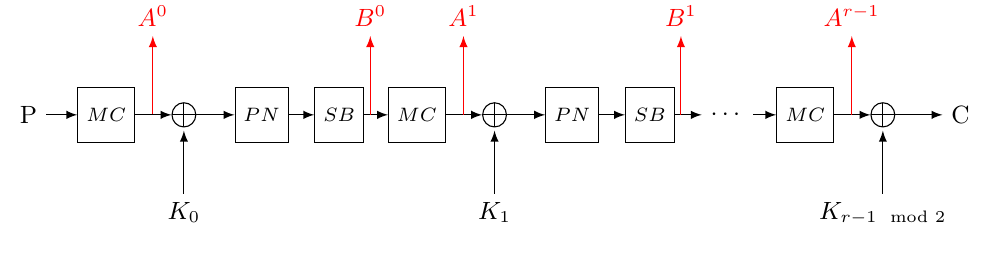

This tool automates the process of analyzing cryptographic ciphers using the Meet-in-the-Middle (MITM) attack. It supports various block ciphers, including CRAFT, Midori64, Midori128, WARP, PRESENT80, and ARADI.

Key features:

✅ Supports regular key and equivalent key attacks.

✅ Generates round keys and defines bit relations for supported ciphers

✅ Allows customization of attack parameters (rounds, printing options, etc.)

✅ Exports results to a file for detailed analysis

✅ Implements guess-and-determine (only for PRESENT80)

📜 Installation

Ensure you have Python 3.x installed. You can check your Python version using:

    python3 --version
    
 
 Install Dependencies

    pip install -r requirements.txt
    
🚀 Usage

Run the tool using the following command:
    
    python3 main.py --cipher <CIPHER> --attack_type <ATTACK_TYPE> [OPTIONS]
    
🔹 Required Arguments:

| Argument       | Description |
|---------------|-------------|
| `--cipher`    | Specifies the cipher to analyze. Choose from: `CRAFT`, `Midori64`, `Midori128`, `WARP`, `PRESENT80`, `ARADI`. |
| `--attack_type` | Defines the attack type: `regular_key` or `equivalent_key`. |

🔹 Optional Arguments:

| Argument                 | Description |
|-------------------------|-------------|
| `--rounds <N>`             | Overrides the default number of rounds (e.g., `--rounds 5`). |
| `--guess_and_determine`    | Enables guess-and-determine (only for `PRESENT80`). |
| `--output <FILENAME>`      | Specifies the output file (default: `output.txt`). |
| `--print_key`              | Prints the generated forward & backward keys. |
| `--print_block`            | Prints forward & backward blocks. |
| `--print_block_car`        | Prints block cardinality. |
| `--print_bit_addr_info`    | Prints bit address information. |
| `--evaluate_key_diffusion` | Evaluate key bit diffusion (requires a key bit, e.g., 'k_13') |
| `--navigate_bit_position`  | Navigate bit position progress (requires a bit position, e.g., 3) |

📌 Example Commands

Running an attack on Midori64 (Regular Key Attack)

    python3 main.py --cipher Midori64 --attack_type regular_key --rounds 5 --print_key --output midori_results.txt    
This command analyzes Midori64 using a regular key attack with 5 rounds, prints the key, and saves results in midori_results.txt.

Running an Equivalent Key Attack on CRAFT

    python3 main.py --cipher CRAFT --attack_type equivalent_key --print_block --print_block_car
Runs an equivalent key attack on CRAFT, printing the block structure and cardinality.

Running Guess-and-Determine on PRESENT80

    python3 main.py --cipher PRESENT80 --attack_type regular_key --guess_and_determine --print_bit_addr_info
Performs guess-and-determine analysis on PRESENT80, printing bit address information.

⚠️ Notes & Limitations

The guess-and-determine technique is only applicable to PRESENT80.

The cipher names are case-insensitive, but must match their official names (Midori64, not MIDORI64).

Equivalent key attacks are not supported for WARP and PRESENT80.

## How to Describe a Cipher to the Tool

To describe a cipher, you need to determine the positions of the bit addresses. As an example, consider the **regular key attack on CRAFT**:

### 1. Generating Round Keys

Each cipher requires round keys based on its key schedule. Refer to generate_round_key.py, which generates round keys for various ciphers.

### 2.  Bit-Level Representation

All cipher components—such as permutations and mix columns—must be described at the **bit level**. The Sage Jupyter file `sage_support_material.ipynb` is useful for understanding and visualizing the bit-level representation of different ciphers.

### 3. Defining Dependencies for S-boxes
 
For determining **bit dependencies in S-boxes**, the component functions should be computed using **SageMath**. See the Sage file `sage_support_material.ipynb` for guidance.

To describe dependencies for the S-box, two dependency lists should be written:
- **`lin_dependent_ind`** → Stores the indices of linearly dependent bits.
- **`non_lin_dependent_ind`** → Stores the indices of non-linearly dependent bits.

⚠️ **Important:** A bit position **must not** appear in both `lin_dependent_ind` and `non_lin_dependent_ind`.  
For example, in **CRAFT**:

    lin_dependent_ind = [[], [], [], []]
    non_lin_dependent_ind = [[0, 1, 2, 3], [0, 1, 2, 3], [0, 1, 3], [0, 1, 2, 3]]
       
### 4. Describing Forward & Backward Directions 

Define two lists:

fwd → Forward encryption operations
bwd → Backward decryption operations

Example for CRAFT (Regular Key Attack):

        directions = [
        ['fwd',
            [['*', 'key_addition']], 
            [n_rounds - 1, ['a', 's_box', s_box_list, perms_box], ['b', 'perm', perm_bit],
                ['c', 'mixing', mix_list], ['d', 'key_addition']], 
            [1, ['a', 's_box', s_box_list, perms_box], ['b', 'key_addition']]
        ],
        ['bwd',
            [1, ['b', '-'], ['a', 'key_addition']], 
            [n_rounds - 1, ['d', 's_box', s_box_list, perms_box],
                ['c', 'key_addition'], ['b', 'mixing', mix_list], ['a', 'perm_inv', perm_bit]]
        ]
        ]

### 5. Supported Operations

| Operation      | Required Parameters               | Optional Parameters               | Example                                      | Notes |
|---------------|----------------------------------|----------------------------------|----------------------------------------------|-------|
| `key_addition` | Name                             | Pattern list                      | `['a', 'key_addition']`                      | Automatically uses the generated round keys. |
| `s_box`       | Name, list of dependencies       | Pattern list, permutation list    | `[pattern, 'a', 's_box', s_box_list]`        | - |
| `mixing`      | Name, list of mixing             | Pattern list, permutation list    | `['a', 'mixing', mix_list, mix_perm_bit]`    | - |
| `perm`        | Name, list of permutation        | -                                  | `['*', 'perm', perm_bit]`                    | - |
| `perm_inv`    | Name, list of permutation        | -                                  | `['b', 'perm_inv', perm_bit]`                | Acts as the inverse of permutation. |
| `xor`         | Name, list of block IDs          | Pattern list                      | `[pattern[1], 'b', 'xor', block_id1]`        | Block ID list contains bit addresses affected by XOR. |
| `'-'`         | Name                             | -                                  | `['b', '-']`                                 | Indicates no action. |

Each sub-list includes a sequence of operations applied at specific bit positions, following the cipher's structure.

Structure of the directions list:

🔹 The first element of each operation list is an integer that specifies how many times the operation is repeated.
If not provided, the operation runs once by default.

🔹 Each operation consists of:

A label (name) for the operation → Used to maintain symmetry between fwd and bwd.
The operation type (e.g., key_addition, s_box, mixing, etc.).
Lists that define dependencies → Used to update the linearly and non-linearly dependent key sets.

📌 Naming Conventions for Operations

Forward (fwd) and Backward (bwd) operations should be symmetric.
 If an operation does not have a natural counterpart in one direction, prefix its name with '*'.
 If no action is needed, use '-' as a placeholder.
     Example: See the regular_key attack for Midori64.

  Handling Partial State Operations

Some operations affect only a portion of the cipher's state (e.g., XOR in Feistel structures). In such cases:

1) Define a pattern list containing the bit indices.
2) Use this pattern list before the operation name in directions.

Monitoring and Debugging the Cipher Description

To validate and debug the cipher’s description, the tool provides two useful arguments:

1️⃣ Navigate Bit Position Progress

🔹 Prints the linearly and non-linearly dependent key bit sets for a specific bit position.
🔹 Useful for verifying that operations are correctly defined.

Usage Example:

    python3 main.py --cipher CRAFT --attack_type regular_key --navigate_bit_position 14

2️⃣ --evaluate_key_diffusion

🔹  Traces key bit diffusion throughout the cipher’s bit positions.
🔹  Helps analyze how key bits propagate through operations.

Usage Example:

    python3 main.py --cipher Midori64 --attack_type equivalent_key --evaluate_key_diffusion k_1

